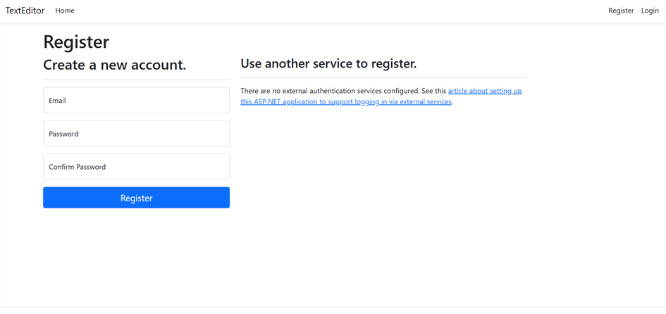

# Text-Editor

The Text Editor App is an application built using .NET technology, allowing users to register using an account and perform various operations on their text documents, including creating, editing, deleting, and printing.

## Features

- User Registration: Users can register for an account to access the text editor functionalities.
- Text Document Operations:
  - Create: Users can create new text documents.
  - Edit: Edit existing text documents.
  - Delete: Delete unwanted text documents.
  - Print: Print text documents directly from the application.

## Technologies Used

- .NET Framework
- C#
- ASP.NET MVC
- Entity Framework
- HTML/CSS
- JavaScript

## Screenshots

